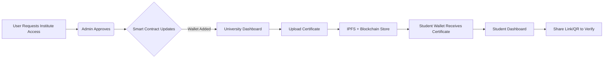

# 🎓 CertiChain - Decentralized Certificate Verification Platform

A powerful Web3 platform to **issue, verify, and manage certificates and degrees** on the blockchain — secure, tamper-proof, and instantly verifiable.

---

## 🚀 Why CertiChain?

Traditional certificate verification is slow, manual, and prone to forgery.  
**CertiChain** leverages the power of **Ethereum, IPFS, and wallet-based identity** to ensure every degree or certificate is:

- 🔐 **Tamper-proof**
- ✅ **Verifiable by anyone**
- 🧾 **Permanently traceable**

---

## 👑 Key Features

### 🧑‍💼 Admin Panel

- Deploys and controls the core smart contract.
- Can **approve or remove** universities/institutes after verification.

### 🏛️ University Onboarding

- Anyone can register and **request to become an institute**.
- Admin verifies and approves the request.
- Approved university’s **wallet is whitelisted** on the smart contract.

### 🎓 Certificate Issuance

- Approved universities can **issue certificates** to any student’s wallet.
- Files are uploaded to **IPFS** and their hash + metadata is stored on the blockchain.
- Each certificate includes: student details, IPFS hash, issuer details, and blockchain tx.

### 👤 Student Dashboard

- Students connect their wallet and see all certificates issued to them.
- **100% decentralized, no login or email required.**

### 🔗 Share & Verify

- Students can **generate a link or QR code** for any certificate.
- Anyone with the link can **verify its authenticity** on-chain.

### 🧾 Bulk Upload

- Universities can **upload multiple certificates at once**.
- Option to **revoke** any issued certificate if needed.

### 💳 Stripe Integration

- **Pay-per-certificate** or subscription options via Stripe.

---

## 🛠️ Tech Stack

| Layer          | Tech Used                         |
| -------------- | --------------------------------- |
| Frontend       | Next.js, TypeScript, Tailwind CSS |
| Backend        | Node.js, Express.js, Prisma       |
| Smart Contract | Solidity (Hardhat)                |
| Blockchain     | Ethereum + Ethers.js              |
| Storage        | IPFS                              |
| Auth           | MetaMask                          |
| Database       | PostgreSQL                        |
| Payments       | Stripe                            |
| DevOps         | Docker                            |

---

## 🧠 How It Works

